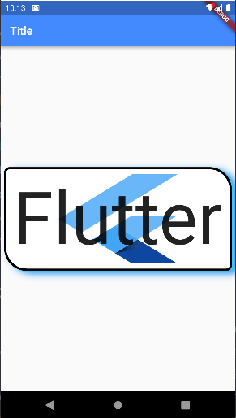

# container_box_decoration

# Flutter Box Decoration Sample
This application demonstrates the use of the BoxDecoration widget in Flutter. It shows how to add color, borders, border radius, images and box shadows to a container.
## Getting Started

This project is a starting point for a Flutter application.

A few resources to get you started if this is your first Flutter project:

- [Lab: Write your first Flutter app](https://docs.flutter.dev/get-started/codelab)
- [Cookbook: Useful Flutter samples](https://docs.flutter.dev/cookbook)

For help getting started with Flutter development, view the
[online documentation](https://docs.flutter.dev/), which offers tutorials,
samples, guidance on mobile development, and a full API reference.
# Technologies Used
The following technologies were used to develop this program:

>Flutter 2.8.1
>Dart 2.15.1
# Screenshots

# How to Use
1. Clone the repository using the following command:
    `git clone https://github.com/your-username/flutter-box-decoration-sample.git`
2. Navigate to the project directory using the following command:
    `cd flutter-box-decoration-sample`
3. Run the application using the following command:
    `flutter run`
    
# Components Used
The `Container widget` has the following properties:

`padding`: sets the padding around the child widget inside the container.
`decoration`: creates the design for the container using BoxDecoration.
`child`: contains the text widget that displays the word "Flutter".
# The BoxDecoration 
The main feature of this app is the customized BoxDecoration applied to the Container widget. The box has a red color background and a black border with a width of 4. The border radius is set to be 40 at the bottom left corner and top right corner, and 10 at the bottom right corner and top left corner. Additionally, there is an image that is set as the background of the box with the DecorationImage class. Finally, two BoxShadow instances are used to create the shadow effect.

The `BoxDecoration` property has the following attributes:
`color`: sets the background color of the container.
`border`: creates a black border around the container with a width of 4.
`borderRadius`: sets the rounded corners of the container.
`image`: adds an image to the container using the URL defined in _url.
`boxShadow`: applies two BoxShadow effects to the container.
# BoxShadow
The `BoxShadow` property has the following attributes:

`color`: sets the color of the shadow.
`offset`: sets the distance and direction of the shadow from the container.
`blurRadius`: sets the amount of blurring for the shadow.
# Dependencies
This program depends on the following packages:

- `flutter/material.dart:` The Material Design framework for Flutter.
# About the Author
This project was created by @Karaxmedov.
# Contributions
Contributions to this program are welcome. If you want to contribute, please follow these steps:
1. Fork the repository.
2. Create a new branch for your feature or bug fix.
3. Implement the feature or fix the bug.
4. Write tests for your code.
5. Submit a pull request.